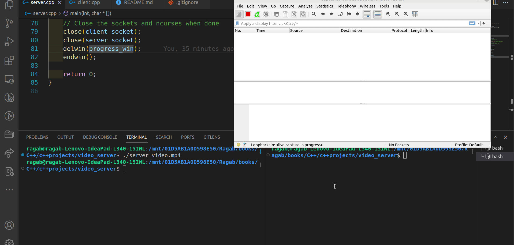

# Video Transfer Project
<!--
-->
<kbd></kbd>

## Description
This project demonstrates a simple video transfer system between a server and a client using C++ and socket programming. The server sends a video file to the client, and the client receives and saves the video file. The code includes a user interface for displaying live progress using the ncurses library.

## Technologies
- C++
- Socket programming
- ncurses (for progress display)

## Project Structure

```

project-directory/
│
├── README.md
├── server.cpp
├── client.cpp
├── video.mp4
├── received_video.mp4 (created by client)
│
```

## Compilation Steps
1. **Compile the Server:**
    ```
    g++ server.cpp -o server -lncurses
    ```
    **Run the Server:**

    ```
    ./server /path/to/your/video.mp4
    ```

    Replace /path/to/your/video.mp4 with the actual path to the video file you want to send.


2. **Compile the Client:**

    ```
    g++ client.cpp -o client -lncurses
    ```
    **Run the Client:**

    ```
    ./client /path/to/save/received_video.mp4
    ```
    Replace /path/to/save/received_video.mp4 with the path and filename where you want to save the received video.

## Notes
- Make sure you have the ncurses library installed on your system for the user interface features.
- The server and client should synchronize and transfer the video while displaying the progress using ncurses.